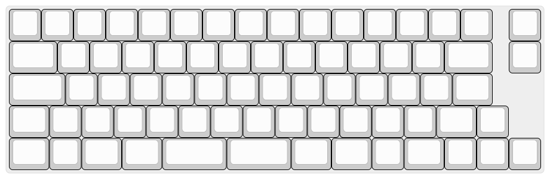

# QMK Compiler Keyboard Error Log

Due to the separation between committing an `info.json` file and that file being consumed by the QMK API, an error log is exposed. You can view that error log here:

> http://compile.qmk.fm/v1/keyboards/error_log

Below you can find a description of each error message and how to fix the error it highlights.

## Falling back to searching for KEYMAP/LAYOUT macros.

Due to the way QMK is structured there are a number of places the `LAYOUT()` macro (or `KEYMAP()` for legacy boards that have not been updated) can be stored. QMK API assumes that it can find the macro in one of these locations:

* `qmk_firmware/keyboards/<subdir1>/<subdir1>.h`
* `qmk_firmware/keyboards/<subdir1>/<subdir2>/<subdir2>.h`
* `qmk_firmware/keyboards/<subdir1>/<subdir2>/<subdir3>/<subdir3>.h`
* `qmk_firmware/keyboards/<subdir1>/<subdir2>/<subdir3>/<subdir4>/<subdir4>.h`
* `qmk_firmware/keyboards/<subdir1>/<subdir2>/<subdir3>/<subdir4>/<subdir5>/<subdir5>.h`

If QMK API does not find the `LAYOUT()` macro in one of those files it will look in every `.h` file in the keyboard's subdirectory. Note that it does not recurse into subdirectories, nor does it search higher in the directory tree. The first `LAYOUT()` macro found will be used.

To eliminate this message move the `LAYOUT()` macro to the proper `<subdirN>.h` file, per the convention listed above.

## Missing layout pp macro for &lt;LAYOUT&gt;

This error occurs when QMK API is not able to locate a `LAYOUT()` macro for the keyboard, or when an alias for a `LAYOUT()` macro was defined but the macro itself was not found. To correct it make sure the `LAYOUT()` macros and all aliases for those macros are defined in the `<subdirN>/<subdirN>.h` file.

## Number of elements in info.json does not match!

This message occurs when the layout defined in `info.json` does not have the same number of elements as the associated `LAYOUT()` macro. To correct it you should add or remove elements from the `info.json` file to match the `LAYOUT()` macro.

Typically this situation occurs when the number of keys in your [keyboard-layout-editor](http://keyboard-layout-editor.com) layout does not match the number of elements in your `LAYOUT()` macro. This often occurs when someone doesn't consider all the layouts available for the PCB they're working on when building the layout. Make sure that the number of keys in your [keyboard-layout-editor](http://keyboard-layout-editor.com) layout matches exactly the number of elements is the first part of your `LAYOUT()` macro.

As an example, consider [this layout](http://www.keyboard-layout-editor.com/#/gists/4e4f1a50b3788231c1109158443d568a) for the Clueboard:

As you can see that depicts a keyboard that is not physically possible to build. In particular, the Enter key is shown here as a 1.25u key, but on a physical keyboard you have to choose between the 2.25u enter key, and the tall ISO enter key. We depict the keyboard in this way because that's the only way we can have the number of keys on the graphical layout match the number of elements in the `LAYOUT()` macro.

When your PCB supports multiple layouts like this the recommended practice is to have the `LAYOUT()` macro support all keys, as shown with the Clueboard, and to define layouts matching different physical builds, for example ISO or ANSI. If your keyboard supports any of QMK's community layouts you should define macros matching those as well.

## &lt;filename&gt; is invalid JSON!

This message occurs when a malformed `info.json` is checked into [`qmk_firmware`](https://github.com/qmk/qmk_firmware). To correct it use a JSON linting tool to locate and fix the bad JSON.

## &lt;filename&gt; is invalid! Should be a JSON dict object!

This message occurs when an `info.json` uses something besides a dictionary as the root object. To correct it make sure that a single JSON dictionary is the root object.

# Error encountered processing &lt;filename&gt;

This occurs when an error we didn't anticipate occurs. Sometimes you can figure out what's wrong from the message, but if not you should hop on gitter and we'll help you figure out what's going on (and maybe fix our bug ;).
